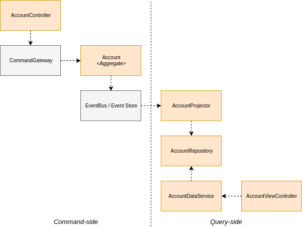

\[TITLE\]
==========

-   Cooks in - \[\] minutes
-   Difficulty - \[easy|moderate|advanced\]



Ingredients
-----------

| Dependency   | Version |
|--------------|---------|
|Axon Framework|3.1.x    |

| Axon Framework Components |
|---------------------------|
|\[Some Axon Framework\]    |


Method
------

### 1 \[title of first step\]

    ```xml 
	Some XML
	```

    ```java 
	Some Java code
	```

Other readings and recipes
===========================

Contact
-------
For any question about the recipe or Axon Framework in general, please contact us via
- [Axon user group](https://groups.google.com/forum/#!forum/axonframework)
- [AxonIQ support](http://www.axoniq.io)
